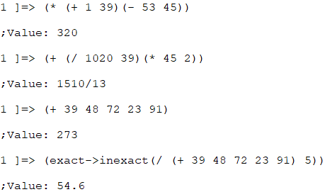
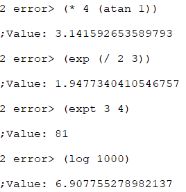

Windows 10 path:

"...\MIT-GNU Scheme\bin\mit-scheme.exe" --heap 512 --library "E:\MIT-GNU Scheme\lib"

- 函数`quotient`用于求**商数（quotient）**。
- 函数`remainder`和`modulo`用于求**余数（remainder）**。
- 函数`sqrt`用于求参数的**平方根（square root）**

数学上的三角函数，诸如`sin`，`cos`，`tan`，`asin`，`acos`和`atan`都可以在Scheme中使用。`atan`接受1个或2个参数。如果`atan`的参数为`1/2 π`，那么就要使用两个参数来计算。

指数通过`exp`函数运算，对数通过`log`函数运算。`a`的`b`次幂可以通过`(expt a b)`来计算。

