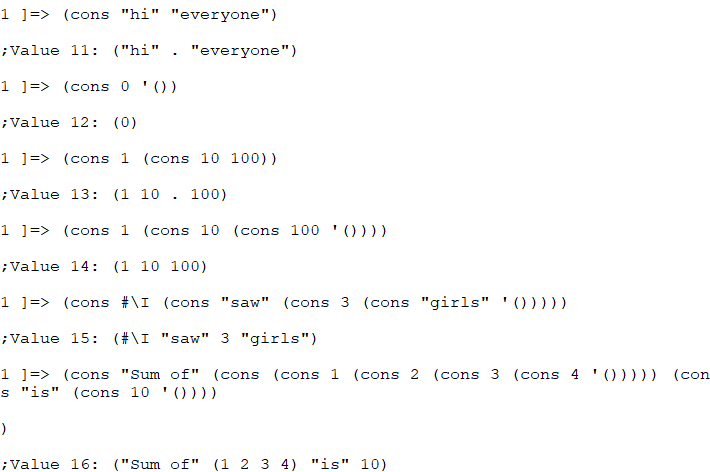
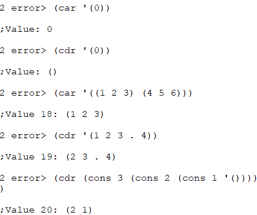

函数`cons`给两个地址分配了内存空间，并把存放指向`1`的地址放在一个空间，把存放指向`2`的地址放在另一个空间。存放指向`1`的地址的内存空间被称作`car`部分，对应的，存放指向`2`的地址的内存空间被称作`cdr`部分。`car`和`cdr`分别是**寄存器地址部分（Contents of the Address part of the Register）**和**寄存器减量部分（Contents of the Decrement part of the Register）**的简称。这些名字最初来源于Lisp首次被实现所使用的硬件环境中内存空间的名字。这些名字同时也表明Cons单元的本质就是一个内存空间。`cons`这个名字是术语**构造（construction）**的简称。

Cons单元也可以被串起来。

Scheme可以通过地址操作所有的数据。（`#\c`代表了一个字符`c`。例如，`#\a`就代表字符`a`）

表是Cons单元通过用`cdr`部分连接到下一个`Cons`单元的开头实现的。表中包含的`’()`被称作空表。就算数据仅由一个Cons单元组成，只要它的`cdr`单元是`’()`，那它就是一个表。图3展示了表`(1 2 3)`的内存结构。

事实上，表可以像下面这样递归地定义：

1. `‘()`是一个表
2. 如果`ls`是一个表且`obj`是某种类型的数据，那么`(cons obj ls)`也是一个表 正因为表是一种被递归定义的数据结构，将它用在递归的函数中显然是合理的。

不使用Cons单元的数据结构称为**原子（atom）**。数字，字符，字符串，向量和空表`’()`都是原子。`’()`既是原子，又是表。

所有的记号都会依据Scheme的求值规则求值：所有记号都会从最内层的括号依次向外层括号求值，且最外层括号返回的值将作为S-表达式的值。一个被称为**引用（quote）**的形式可以用来阻止记号被求值。它是用来将符号或者表原封不动地传递给程序，而不是求值后变成其它的东西。

因为`quote`的使用频率很高，他被简写为`’`。

Scheme有两种不同类型的操作符：其一是函数。函数会对所有的参数求值并返回值。另一种操作符则是特殊形式。特殊形式不会对所有的参数求值。除了`quote`，`lambda`，`define`，`if`，`set!`，等都是特殊形式。

`list`函数使得我们可以构建包含数个元素的表。函数`list`有任意个数的参数，且返回由这些参数构成的表。